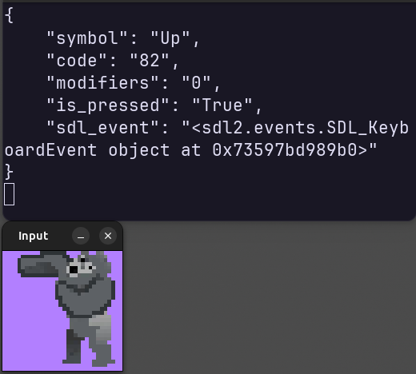
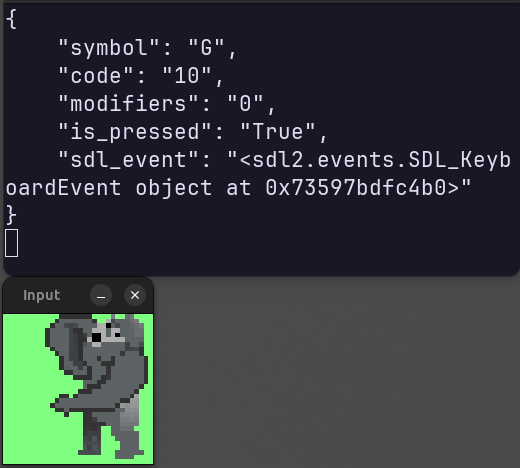

# Gogo Keyboard
## Press keyboard 🦍 Get key 🦍  Unga Bunga

| Requirements | Compatibility |
|---|---|
| [](https://pypi.org/project/asyncio_for_robotics/)<br><br>[](https://opensource.org/license/mit)|  <br>[](https://github.com/ros2) <br>[](https://zenoh.io/) |

Python Asyncio library to simply get keyboard presses and releases. Gogo Keyboard creates a new independent SDL2 window that captures the key events.

```python3
pip install https://github.com/2lian/gogo_keyboard.git[dll]
python3 -m gogo_keyboard.example
```

Motivation:
- Keyboard presses and releases in Asyncio.
- Only when clicking on the Gorilla window.
- Python terminal is free for other tasks.
- Based on [`asyncio_for_robotics`](https://github.com/2lian/asyncio-for-robotics) for seamless compatibility with:
  - ROS 2
  - Zenoh
  - More

|  |  |  |
|---|---|---|

## Installation

This library requires `sdl2` and `sdl2_image`. By specifying the `[dll]` optional dependency, those will be installed by pip.

```python3
pip install gogo_keyboard[dll]
```

Conda pacakge: soon!

## Python Example

Example is [provided here](./src/gogo_keyboard/example.py) and can be run with `python3 -m gogo_keyboard.example`.

Here is a minimal piece of working code:

```python
import asyncio
from gogo_keyboard.keyboard import KeySub

async def async_main():
    key_sub = KeySub()
    async for key in key_sub.listen_reliable():
        print(key)

asyncio.run(async_main())
```

## ROS 2 Example (Humble, Jazzy, Kilted)

A very simple ROS 2 node is [provided here](./src/gogo_keyboard/ros_node.py), run it with `python3 -m gogo_keyboard.ros_node`. The messages format is a `json` formatted `String`, 🦍 simple 🦍  Unga Bunga.

## Zenoh Example

A very simple Zenoh publisher is [provided here](./src/gogo_keyboard/zenoh_node.py), run it with `python3 -m gogo_keyboard.zenoh_node`. The messages format is a `json` formatted `String`, 🦍 simple 🦍  Unga Bunga.
